# Registration of the Publishers and participants in federated environment

## Introduction

The UC Registration module is designed to test the registration of publisher providers
(SMPs) and participants within a federated SML service environment. The tests are 
designed to assume that all necessary SMP DNS records (e.g. publisher records) for 
the subzone are stored on the subdomain's authoritative DNS server (e.g., 9914, 0195).
This model is also known in the Peppol Federated model PoC as the 2.B.1 registration model.

The big advantage of this model is best back-compatibility fit on the registration
process and existing SML services. The only difference is that SMPs must register 
to each SML authoritative subzone service where they will offer the registration 
of the participant records. Another big advantage is that the SML service provider
is the only one responsible to keep SML clean without "dangling" records across
multiple DNS servers.


The primary advantage of this model is its superior backward compatibility with the 
registration process using existing SML service API. The only change required is that 
SMPs must register with each SML authoritative subzone service where they intend to
offer for participants. Another significant benefit is that the SML service provider 
is solely responsible for maintaining a clean SML DNS records, without "dangling"
records spread across multiple DNS servers.

##  Testing environment setup

The existing Testing environment is extended with the following components:

 - **Ecosystem SML service** - The top-level domain SML service, responsible for
   managing the DNS records for the subdomain 0088 .
 - **Domain 0195 SML service** - The subdomain 0195 SML service, responsible for managing
   the DNS records for the subdomain 0195.
 - **Domain 9924 SML service** - The subdomain 9924 SML service, responsible for managing
   the DNS records for the subdomain 9924.

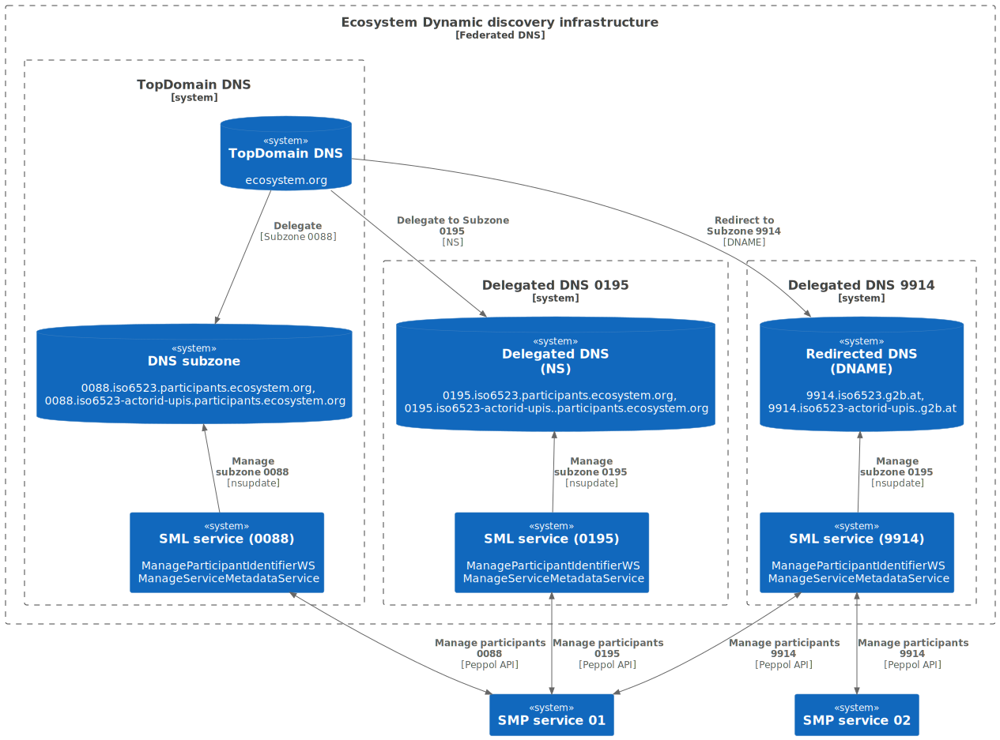

## Use cases

The PoC environment is designed to showcase various methods of subdomain delegation
within DNS infrastructure, as well as different strategies for organizing internal
DNS server records (e.g using CNAME for easier maintenance of final DNS record data).
The following tests cases are using exiting SML service implementation which supports 
the SML service API as defined in the [PEPPOL SML specification.](https://docs.peppol.eu/edelivery/sml/ICT-Transport-SML_Service_Specification-101.pdf)

### Use case 1: Registration of SML service providers in the top-level domain "sml.ecosystem.org" DNS server

The use case is designed to test the registration of the SML service providers in
the top-level domain SML service. The test involves the registration of CNAME and 
NAPTR records for the SML service providers in the top-level domain DNS server. 

The records provide an easy lookup for the SMP service providers to automatically 
locate the SML service API where particular subdomain (e.g. 0088, 0195, 9914) records 
are managed.

In the tests two types of records are explored:

- **CNAME Records** serve as aliases for the DNS entries of the SML service provider. 
These records enable the SMP provider to simply use the ecosystem SML URL template 
(e.g., https://[subdomain].sml.ecosystem.org/sml) to use  the actual SML service API URL.
The URL scheme, port, and context path are predefined according to the ecosystem's regulations. 
Consequently, the SML service provider must publish services in compliance with these rules,
including ensuring the server certificate matches requirements when using the HTTPS URL scheme.
 
- **NAPTR Records** are used to retrieve the custom URL of the SML service provider's. 
In this case the SML service provider defines their own URL scheme, port, and context path 
and register then to the top-level domain DNS server. The NAPTR records gives more freedom 
to SML service providers on how they want to publish their services, but on the ather hand, 
the SMP provider has one more step to resolve the actual SML service API URL.


## 1.a. Registration of the CNAME record for the SML service providers

The usecase contains registration of CNAME records for the SML service providers (0088, 0195, 9924) in the top-level domain DNS server and verification of the lookup of th e SML service.

1. Registration of the CNAME records for the SML service providers
2. Lookup of the SML service API CNAME record

## 1.b. Registration of the NAPTR record for the SML service providers

The usecase contains registration of NAPTR records for the SML service providers (0088, 0195, 9924) in the top-level domain DNS server and verification of the lookup of th e SML service.

1. Registration of the NAPTR records for the SML service providers
2. Lookup of the SML service API NAPTR record


### Use case 2: Registration of the Publishers and participants in the top-level domain "0088 authoritative" DNS server

The usecase is designed to test the registration of the SMPs and participants in the  domain "0088" which is managed by the top-level domain SML service. The test case involves the following steps: 

- **2.a.**: Locate the SML service for the domain "0088" using the DNS lookup.
- **2.b.**: Register the SMP data to the subdomain 0088 DNS server.
- **2.c.**: Register the participant data to the subdomain 0088 DNS server.
- **2.d.**: Registering invalid participant (e.g. 0195, 9914)  data to the subdomain 0088 DNS server must fail.
- **2.e.**: Update the SMP URL to new value
- **2.f.**: Delete the participant data from the subdomain 0088 DNS server.
- **2.g.**: Delete the SMP data from the subdomain 0088 DNS server.


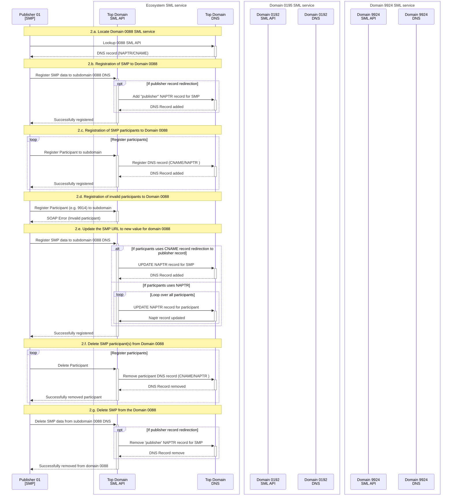

### Use case 3: Registration of the Publishers and participants in the Delegated (NS): "0195 authoritative" DNS server

The usecase is designed to test the registration of the SMPs and participants in the domain "0195" which is managed by the dedicated authoritative 0195 domain SML service. The SML service is using the "NS binding" to redirect the DNS queries to the top-level domain SML service.

The test case involves the following steps:

- **3.a.**: Locate the SML service for the domain "0195" using the DNS lookup.
- **3.b.**: Register the SMP data to the subdomain 0195 DNS server.
- **3.c.**: Register the participant data to the subdomain 0195 DNS server.
- **3.d.**: Registering invalid participant (e.g. 0088, 9914)  data to the subdomain 0195 DNS server must fail.
- **3.e.**: Update the SMP URL to new value
- **3.f.**: Delete the participant data from the subdomain 0195 DNS server.
- **3.g.**: Delete the SMP data from the subdomain 0195 DNS server.


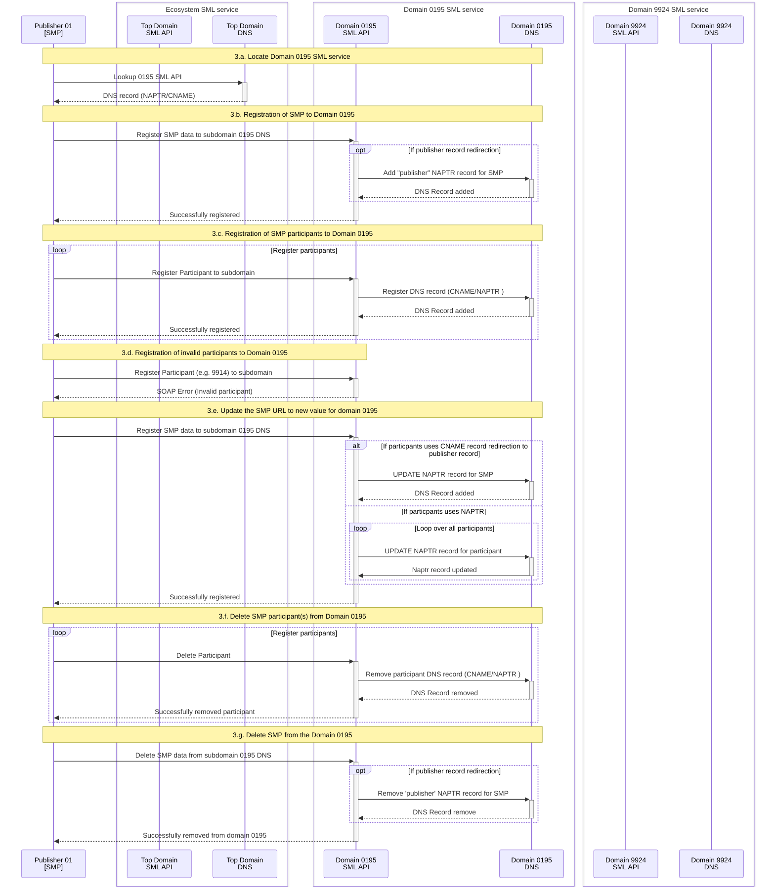


### Use case 4: Registration of the Publishers and participants in the Redirected (DNAME): "9914 authoritative" DNS server

The usecase is designed to test the registration of the SMPs and participants in the domain "9914" which is managed by the dedicated authoritative 9914 domain SML service. The SML service is using the "DNAME binding" to redirect the DNS queries to the top-level domain SML service.

The test case involves the following steps:

- **4.a.**: Locate the SML service for the domain "0195" using the DNS lookup.
- **4.b.**: Register the SMP data to the subdomain 0195 DNS server.
- **4.c.**: Register the participant data to the subdomain 0195 DNS server.
- **4.d.**: Registering invalid participant (e.g. 0088, 0195)  data to the subdomain 9914 DNS server must fail.
- **4.e.**: Update the SMP URL to new value
- **4.f.**: Delete the participant data from the subdomain 0195 DNS server.
- **4.g.**: Delete the SMP data from the subdomain 0195 DNS server.


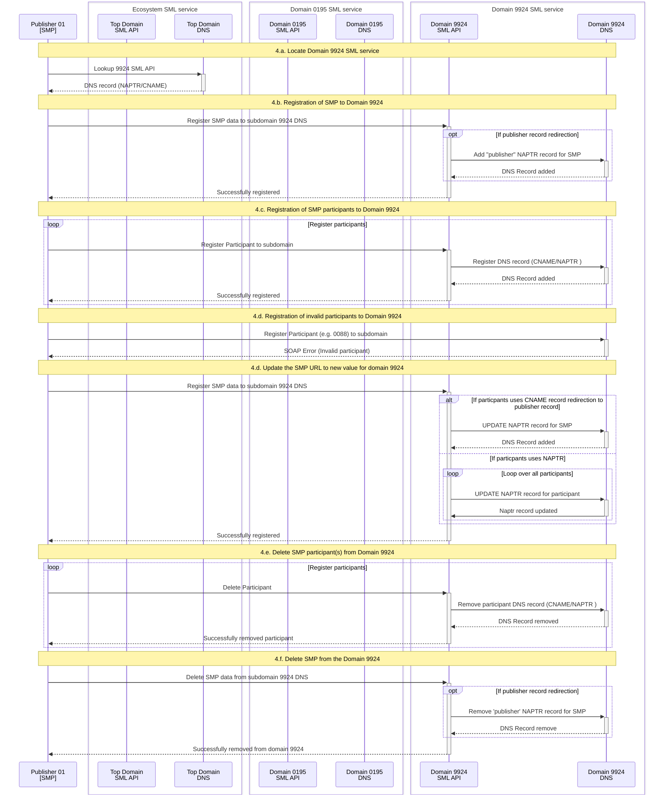


## Environment Setup

To execute the tests for the use cases, the DNS infrastructure as described in the [README.md](../README.md) was
extended with the following [docker services](docker-compose.yml)

- **ecosystem-top-domain-sml** - The top-level domain SML service, responsible for
  managing the DNS records for the subdomain 0088 .
- **invoice-sg-sml** - The subdomain 0195 SML service, responsible for managing
  the DNS records for the subdomain 0195.
- **vat-num-at-sml** - The subdomain 9924 SML service, responsible for managing
  the DNS records for the subdomain 9924.

All new docker services are using the same docker image [domisml:5.0.RC1](./docker-domisml/README.md).
Because the docker image is not accessible from any public docker repository (e. g. dockerhub), the image must be built locally before executing the tests. The image is built using the following command:

```shell
  docker compose -f docker-domisml/docker-compose.yml build
```
For detailed information on how to build the docker image, please refer to the [README.md](./docker-domisml/README.md) file.

Tests 2, 3, and 4 require the SoapUI application, which can be downloaded from the [SmartBear: SoapUI Open Source](https://www.soapui.org/downloads/soapui/) website. For these tests, the SoapUI project **FederatedDNS PoC** was created. The project file is located in the testcase folder: *uc04-registration* with filename: *domisml-soapui-project-examples.xml*. To execute test cases 2–4, launch the SoapUI application and import the project file.


## Running the PoC


    # Start the PoC environment (skip the folder uc04-registration if you are already in uc04-registration folder )
    docker compose -f uc04-registration/docker-compose.yml  up -d

    # Stop the PoC environment
    docker compose -f uc04-registration/docker-compose.yml down -v

    # 'clean restart' the PoC environment
    docker compose -f uc04-registration/docker-compose.yml down -v && docker compose -f uc04-registration/docker-compose.yml up -d

Before starting the PoC environment, make sure that log files in the `logs` directory have read and write permissions for all users. If not, run the following command:

    chmod a+rw logs/*
    # or
    chmod a+rw uc04-transition/logs/*

WARNING: the tests will update the zone files: 
- config/ecosystem-top-domain/db.ecosystem.org
- config/invoice-sg/db.0195.iso6523.participants.ecosystem.org
- config/invoice-sg/db.0195.iso6523-actorid-upis.participants.ecosystem.org
- config/vat-num-at/db.9914.iso6523.g2b.at
- config/db.9914.iso6523-actorid-upis.g2b.at

Before executing the tests, commit all manual changes to the file or make a backup of the files and rollback the 
changes after the tests are executed.

Please note that all new SML containers expose ports to access sml service API. The ports are:

- ecosystem-top-domain-sml: 10088
- invoice-sg-sml: 10195
- vat-num-at-sml: 19914


After starting the PoC environment, check all running containers:

    docker ps --format '{{.Names}}' | sort
    #Response:
    client-with-rdns
    ecosystem-top-domain
    ecosystem-top-domain-sml
    invoice-sg
    invoice-sg-sml
    vat-num-at
    vat-num-at-sml

Please note that each DNS server has now dedicated SML service which provides management API for the DNS.


Simple smoke tests to resolve A records. The purpose of the test is to verify that the DNS server is running and resolving the DNS queries. Result for all queries should be the IP address 127.0.0.1

    # Test all SML services are up and runnging (using wget from client-with-rdns container)
    docker exec -it client-with-rdns wget --spider http://ecosystem-top-domain-sml:8080/edelivery-sml
    docker exec -it client-with-rdns wget --spider http://invoice-sg-sml:8080/edelivery-sml
    docker exec -it client-with-rdns wget --spider http://vat-num-at-sml:8080/edelivery-sml
    # all responses shuld return:
    #    Connecting to ecosystem-top-domain-sml:8080 (172.20.0.202:8080) 
    #    remote file exists

Another option is just to add the following URL address to docker hosts browser
(please note the port number for each SML service):

    http://localhost:10088/edelivery-sml/
    http://localhost:10195/edelivery-sml/
    http://localhost:19914/edelivery-sml/

    #to see all SML registerd DNS records on the SML service
    http://localhost:10088/edelivery-sml/listDN
    http://localhost:10195/edelivery-sml/listDN
    http://localhost:19914/edelivery-sml/listDN


### Test: Use case 1.a: Registration of the CNAME record for the SML service providers 

The purpose of this test is to confirm the registration of CNAME records for SML service providers (0088, 0195, 9924) in the top-level domain DNS server and to validate the lookup functionality for the SML service. The `nsupdate` command is used to register CNAME records. This command is executed within the `ecosystem-top-domain` container using the following syntax:


    docker exec -it ecosystem-top-domain sh -c 'echo -e "server localhost\nzone ecosystem.org.\n update \
            add 0088.sml.ecosystem.org. 60  CNAME ecosystem-top-domain-sml.\n \
            add 0195.sml.ecosystem.org. 60  CNAME invoice-sg-sml.\n \
            add 9914.sml.ecosystem.org. 60  CNAME vat-num-at-sml.\n  \
            send" | nsupdate -4'

Explanation of the command:

To add records to the DNS server, the `nsupdate` command is used. To execute the in the `ecosystem-top-domain` container the docker command `docker exec -it ecosystem-top-domain` is used.

The following `nsupdate` command consists of the following parts:

- `sh -c echo -e `: Prints the update request to the standard shell output which is the input for the nsupdate.
- The update request consists of the following parts:
    - `server localhost`: Specifies the DNS server to which the update request is sent.
    - `zone ecosystem.org.`: Specifies the zone to be updated.
    - `update`:
        - `add 0088.sml.ecosystem.org. 60  CNAME ecosystem-top-domain-sml.`: Adds a CNAME record for the ecosystem-top-domain-sml hostname. 
        - `add 0195.sml.ecosystem.org. 60  CNAME invoice-sg-sml.`: Adds a CNAME record for the invoice-sg-sml hostname.
        - `add 9914.sml.ecosystem.org. 60  CNAME vat-num-at-sml.`: Adds a CNAME record for the vat-num-at-sml hostname.
    - `send`: Sends the update request to the DNS server.

After configuration the new CNAME records are shown in the DNS list of the Top domain SML service API. The list is available at the following URL address:

    http://localhost:10088/edelivery-sml/listDNS

The DNS records should be resolved by the ecosystem DNS server.

    # Commands to resolve CNAME recors on  ecosystem top domain
    dig @localhost -p 54  0088.sml.ecosystem.org
    dig @localhost -p 54  0195.sml.ecosystem.org
    dig @localhost -p 54  9914.sml.ecosystem.org

Responses (following the request order above):

    ;; ANSWER SECTION:
    0088.sml.ecosystem.org.	60	IN	CNAME	ecosystem-top-domain-sml.

    ;; ANSWER SECTION:
    0195.sml.ecosystem.org.	60	IN	CNAME	invoice-sg-sml.

    ;; ANSWER SECTION:
    9914.sml.ecosystem.org.	60	IN	CNAME	vat-num-at-sml.


### Test: Use case 1.b: Registration of the NAPTR record for the SML service providers 

The purpose of this test is to confirm the registration of NAPTR records for SML service providers (0088, 0195, 9924) in the top-level domain DNS server and to validate the lookup functionality for the SML service. The `nsupdate` command is used to register NAPTR records. This command is executed within the `ecosystem-top-domain` container using the following syntax:

    docker exec -it ecosystem-top-domain sh -c 'echo -e "server localhost\nzone ecosystem.org.\n update \
        add 0088.sml-api.ecosystem.org. 60 IN NAPTR 100 10 \"U\" \"Meta:SML\" \"!.*!http://ecosystem-top-domain-sml/edelivery-sml/!\" .\n \
        add 0195.sml-api.ecosystem.org. 60 IN NAPTR 100 10 \"U\" \"Meta:SML\" \"!.*!http://invoice-sg-sml/edelivery-sml/!\" .\n \
        add 9914.sml-api.ecosystem.org. 60 IN NAPTR 100 10 \"U\" \"Meta:SML\" \"!.*!http://vat-num-at-sml/edelivery-sml/!\" .\n \
        send" | nsupdate -4'

For detailed information on the `nsupdate` command, please refer to the explanation in the previous test. The only difference is the NAPTR record type and the record data. Please note that the naptr record domain name is different from the CNAME record domain name, because the CNAME record can not have the same domain name as other record types.


After configuration the new NAPTR records are shown in the DNS list of the Top domain SML service API. The list is available at the following URL address:

    http://localhost:10088/edelivery-sml/listDNS

Records on the list

    0088.sml-api.ecosystem.org.	60	IN	NAPTR	100 10 "U" "Meta:SML" "!.*!http://ecosystem-top-domain-sml/edelivery-sml/!" .
    0195.sml-api.ecosystem.org.	60	IN	NAPTR	100 10 "U" "Meta:SML" "!.*!http://invoice-sg-sml/edelivery-sml/!" .
    9914.sml-api.ecosystem.org.	60	IN	NAPTR	100 10 "U" "Meta:SML" "!.*!http://vat-num-at-sml/edelivery-sml/!" .


The DNS records should be resolved by the ecosystem DNS server.

    # Commands to resolve NAPTR recors on  ecosystem top domain
    dig @localhost -p 54  0088.sml-api.ecosystem.org NAPTR
    dig @localhost -p 54  0195.sml-api.ecosystem.org NAPTR
    dig @localhost -p 54  9914.sml-api.ecosystem.org NAPTR

Responses (following the request order above):

    ;; ANSWER SECTION:
    0088.sml-api.ecosystem.org. 60	IN	NAPTR	100 10 "U" "Meta:SML" "!.*!http://ecosystem-top-domain-sml/edelivery-sml/!" .

    ;; ANSWER SECTION:
    0195.sml-api.ecosystem.org. 60	IN	NAPTR	100 10 "U" "Meta:SML" "!.*!http://invoice-sg-sml/edelivery-sml/!" .
    
    ;; ANSWER SECTION:
    9914.sml-api.ecosystem.org. 60	IN	NAPTR	100 10 "U" "Meta:SML" "!.*!http://vat-num-at-sml/edelivery-sml/!" .


### Test: Use case 2: Registration of the Publishers and participants in the top-level domain "0088 authoritative" DNS server

NOTE: Please execute Test 1.a and 1.b before executing the test 2.a to ensure that the SML service is correctly registered in the top-level domain DNS server.

The following tests from 2.b are executed using the SoapUI project *FederatedDNS PoC* and the test case "TestCases 2.x".


#### Test: Use case 2.a.: Locate the SML service for the domain "0088" using the DNS lookup.

Execute the following command to resolve the CNAME and NAPTR records for the 0088 domain:

    # Commands to resolve CNAME recors on  ecosystem top domain
    dig @localhost -p 54  0088.sml.ecosystem.org
    # Commands to resolve NAPTR recors on  ecosystem top domain
    dig @localhost -p 54  0088.sml-api.ecosystem.org NAPTR

Responses (following the request order above):
    
    ;; ANSWER SECTION:
    0088.sml.ecosystem.org.	60	IN	CNAME	ecosystem-top-domain-sml.

    ;; ANSWER SECTION:
    0088.sml-api.ecosystem.org. 60	IN	NAPTR	100 10 "U" "Meta:SML" "!.*!http://ecosystem-top-domain-sml/edelivery-sml/!" .


#### Test: Use case 2.b.:  Register the SMP data to the subdomain 0088 DNS server.

Open the soapui project *FederatedDNS PoC* locate the test case "TestCases 2.x". 
Open and run first step "RegisterSMP: SMP-POC-01".

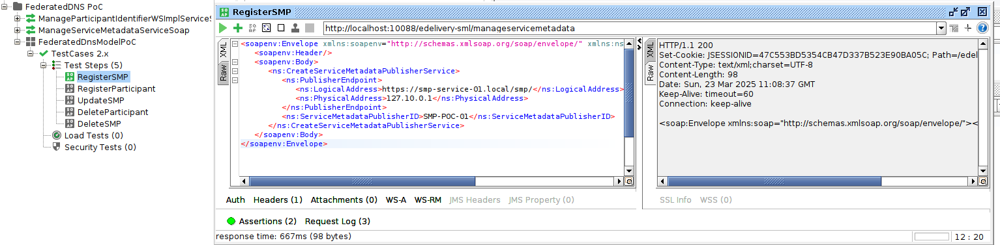

The step registers SMP with identifier SMP-POC-01 to SML-0088 service api, which is exposed to docker host
on port 10088: http://localhost:10088/edelivery-sml/

**Result**:
 
- The response includes an HTTP 200 status code accompanied by a valid SOAP message
- The http://localhost:10088/edelivery-sml/listDNS contains SMP record:
`SMP-POC-01.publisher.0088.iso6523.participants.ecosystem.org.	60	IN	CNAME	smp-service-01-updated.local`

#### Test: Use case 2.c.: Register the participant data to the subdomain 0088 DNS server.

In the soapui project *FederatedDNS PoC* locate the test case "TestCases 2.x".
Open and run step "RegisterParticipant 0088:1234567890".

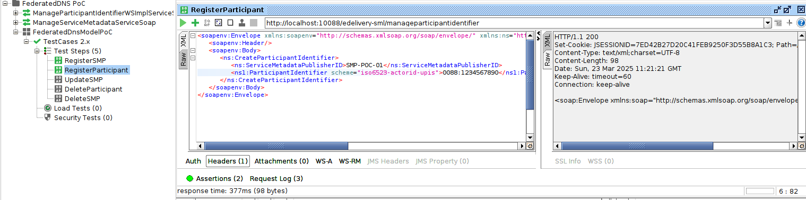

**Result**:

- The response includes an HTTP 200 status code accompanied by a valid SOAP message
- The http://localhost:10088/edelivery-sml/listDNS contains participant record:
  `RJUAFVEKBQJSVT3HDHLN34S4BVVM5GBFTPD5TDI5BTBTKXKBNTNA.iso6523-actorid-upis.0088.iso6523.participants.ecosystem.org.	60	IN	NAPTR	100 10 "U" "Meta:SMP" "!.*!https://smp-service-01.local/smp/!"`


#### Test: Use case 2.d.: Registering invalid participant (e.g. 0195, 9914)  data to the subdomain 0088 DNS server must fail.

In the soapui project *FederatedDNS PoC* locate the test case "TestCases 2.x".
Open and run step "RegisterInvalidParticipant 9914:1234567890".

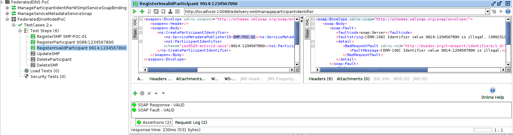

**Result**:

- The response includes an HTTP 400(500) status code accompanied by a SOAP Fault message
- The http://localhost:10088/edelivery-sml/listDNS does not contain any new record:


#### Test: Use case 2.e.: Update the SMP URL to new value

In the soapui project *FederatedDNS PoC* locate the test case "TestCases 2.x".
Open and run step "UpdateSMP". The step updates the SMP URL to the new value: https://smp-service-01-updated.local/smp/.

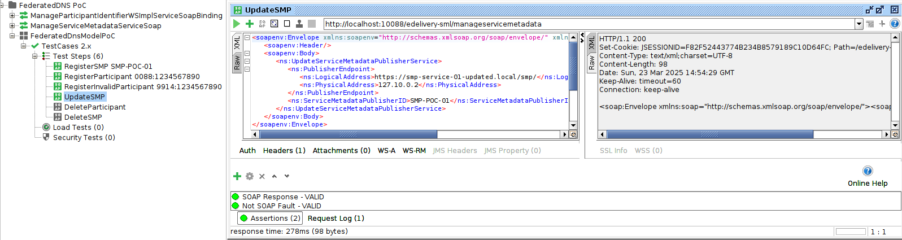

**Result**:

- The response includes an HTTP 200 status code accompanied by a valid SOAP message
- The http://localhost:10088/edelivery-sml/listDNS contains updated SMP and participant naptr records:
  `RJUAFVEKBQJSVT3HDHLN34S4BVVM5GBFTPD5TDI5BTBTKXKBNTNA.iso6523-actorid-upis.0088.iso6523.participants.ecosystem.org.	60	IN	NAPTR	100 10 "U" "Meta:SMP" "!.*!https://smp-service-01-updated.local/smp/!" 
  SMP-POC-01.publisher.0088.iso6523.participants.ecosystem.org.	60	IN	CNAME	smp-service-01-updated.local.`

#### Test: Use case 2.f.: Delete the participant data from the subdomain 0088 DNS server.

In the soapui project *FederatedDNS PoC* locate the test case "TestCases 2.x".
Open and run step "DeleteParticipant 0088:1234567890". The step removes the participant record from the SML-0088 service.

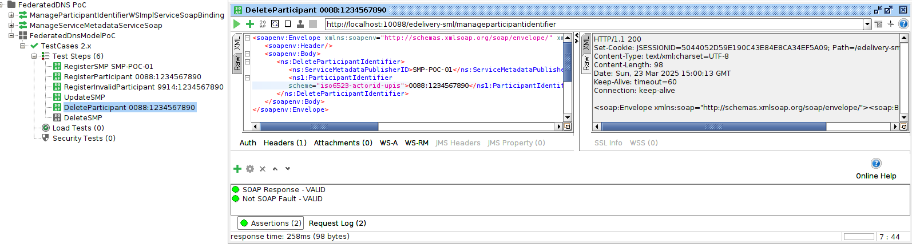

**Result**:

- The response includes an HTTP 200 status code accompanied by a valid SOAP message
- The http://localhost:10088/edelivery-sml/listDNS does not contain participant naptr records:
  `RJUAFVEKBQJSVT3HDHLN34S4BVVM5GBFTPD5TDI5BTBTKXKBNTNA.iso6523-actorid-upis.0088.iso6523.participants.ecosystem.org.	60	IN	NAPTR	100 10 "U" "Meta:SMP" "!.*!https://smp-service-01-updated.local/smp/!"`

#### Test: Use case 2.g.: Remove the SMP record from the subdomain 0088 DNS server..

In the soapui project *FederatedDNS PoC* locate the test case "TestCases 2.x".
Open and run step "DeleteSMP SMP-POC-01". The step removes the participant record from the SML-0088 service.

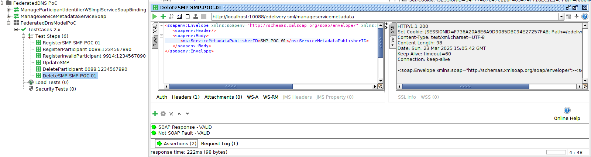

**Result**:

- The response includes an HTTP 200 status code accompanied by a valid SOAP message
- The http://localhost:10088/edelivery-sml/listDNS does not contain participant naptr records:
  `SMP-POC-01.publisher.0088.iso6523.participants.ecosystem.org.	60	IN	CNAME	smp-service-01-updated.local.`


### Test: Use case 3: Registration of the Publishers and participants in subdomain "0195 authoritative" DNS server

NOTE: Please execute Test 1.a and 1.b before executing the test 3.a to ensure that the SML service is correctly registered in the top-level domain DNS server.

The following tests from 3.b are executed using the SoapUI project *FederatedDNS PoC* and the test case "TestCases 3.x".


#### Test: Use case 3.a.: Locate the SML service for the domain "0195" using the DNS lookup.

Execute the following command to resolve the CNAME and NAPTR records for the 0195 domain:

    # Commands to resolve CNAME recors on  ecosystem top domain
    dig @localhost -p 54  0195.sml.ecosystem.org
    # Commands to resolve NAPTR recors on  ecosystem top domain
    dig @localhost -p 54  0195.sml-api.ecosystem.org NAPTR

Responses (following the request order above):

    ;; ANSWER SECTION:
    0195.sml.ecosystem.org. 60      IN      CNAME   invoice-sg-sml.

    ;; ANSWER SECTION:
    0195.sml-api.ecosystem.org. 60  IN      NAPTR   100 10 "U" "Meta:SML" "!.*!http://invoice-sg-sml/edelivery-sml/!" .


#### Test: Use case 3.b.:  Register the SMP data to the subdomain 0195 DNS server.

Open the soapui project *FederatedDNS PoC* locate the test case "TestCases 3.x".
Open and run first step "RegisterSMP: SMP-POC-02".

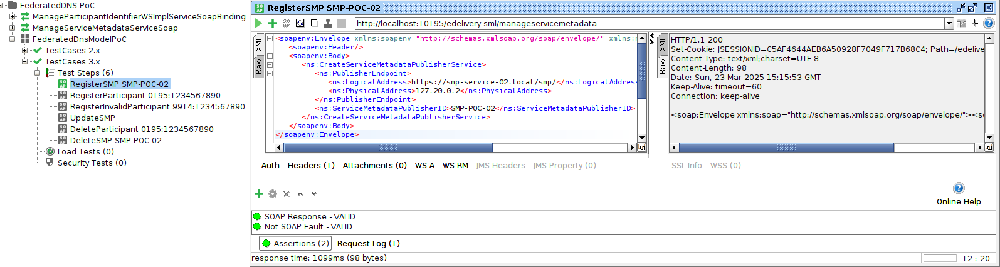

The step registers SMP with identifier SMP-POC-02 to SML-0195 service api, which is exposed to docker host
on port 10195: http://localhost:10195/edelivery-sml/

**Result**:

- The response includes an HTTP 200 status code accompanied by a valid SOAP message
- The http://localhost:10195/edelivery-sml/listDNS contains SMP record:
  `SMP-POC-02.publisher.0195.iso6523.participants.ecosystem.org.	60	IN	CNAME	smp-service-02.local.`

#### Test: Use case 3.c.: Register the participant data to the subdomain 0195 DNS server.

In the soapui project *FederatedDNS PoC* locate the test case "TestCases 3.x".
Open and run step "RegisterParticipant 0195:1234567890".

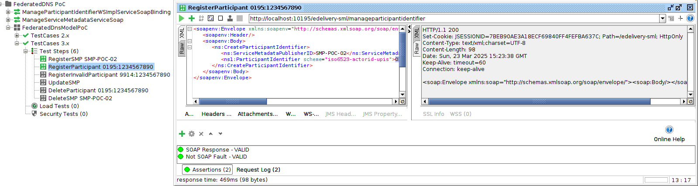

**Result**:

- The response includes an HTTP 200 status code accompanied by a valid SOAP message
- The http://localhost:10195/edelivery-sml/listDNS contains participant record:
  `NRRK5HZLEYDDI2HDM5ADA72CPUFVYXC5HK3YO7OEBB52UHN6DMRA.iso6523-actorid-upis.0195.iso6523.participants.ecosystem.org.	60	IN	NAPTR	100 10 "U" "Meta:SMP" "!.*!https://smp-service-02.local/smp/!" `


#### Test: Use case 3.d.: Registering invalid participant (e.g. 0088, 9914)  data to the subdomain 0195 DNS server must fail.

In the soapui project *FederatedDNS PoC* locate the test case "TestCases 3.x".
Open and run step "RegisterInvalidParticipant 9914:1234567890".

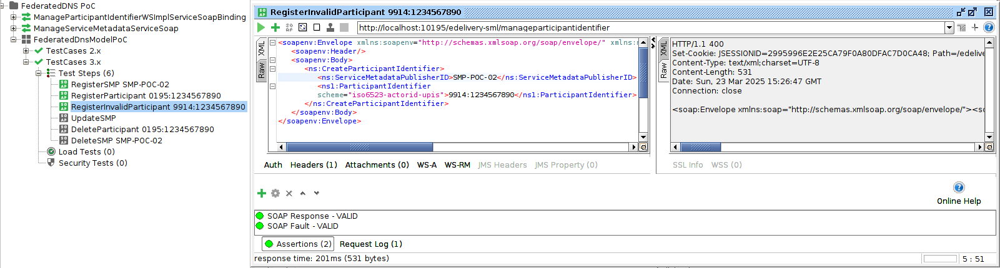

**Result**:

- The response includes an HTTP 400(500) status code accompanied by a SOAP Fault message
- The http://localhost:10195/edelivery-sml/listDNS does not contain any new record:


#### Test: Use case 3.e.: Update the SMP URL to new value

In the soapui project *FederatedDNS PoC* locate the test case "TestCases 3.x".
Open and run step "UpdateSMP". The step updates the SMP URL to the new value: https://smp-service-02-updated.local/smp/.

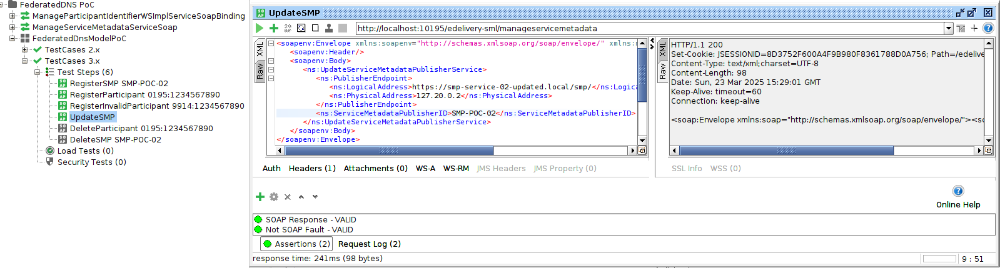

**Result**:

- The response includes an HTTP 200 status code accompanied by a valid SOAP message
- The http://localhost:10195/edelivery-sml/listDNS contains updated SMP and participant naptr records:
  `NRRK5HZLEYDDI2HDM5ADA72CPUFVYXC5HK3YO7OEBB52UHN6DMRA.iso6523-actorid-upis.0195.iso6523.participants.ecosystem.org.	60	IN	NAPTR	100 10 "U" "Meta:SMP" "!.*!https://smp-service-02.local-updated/smp/!"" 
  SMP-POC-02.publisher.0088.iso6523.participants.ecosystem.org.	60	IN	CNAME	smp-service-02-updated.local.`

#### Test: Use case 3.f.: Delete the participant data from the subdomain 0195 DNS server.

In the soapui project *FederatedDNS PoC* locate the test case "TestCases 3.x".
Open and run step "DeleteParticipant 0195:1234567890". The step removes the participant record from the SML-0195 service.

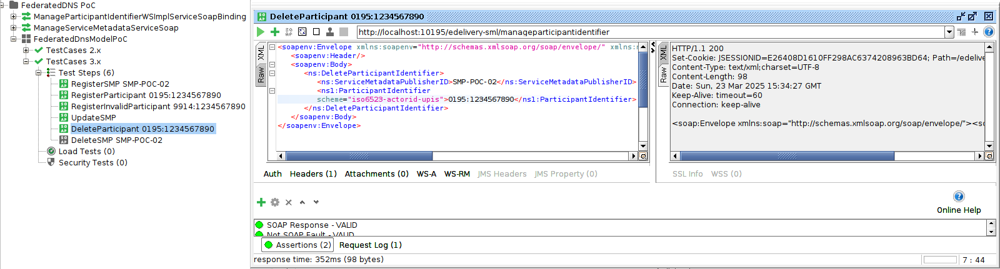

**Result**:

- The response includes an HTTP 200 status code accompanied by a valid SOAP message
- The http://localhost:10195/edelivery-sml/listDNS does not contain participant naptr records:
  `NRRK5HZLEYDDI2HDM5ADA72CPUFVYXC5HK3YO7OEBB52UHN6DMRA.iso6523-actorid-upis.0195.iso6523.participants.ecosystem.org.	60	IN	NAPTR	100 10 "U" "Meta:SMP" "!.*!https://smp-service-02.local-updated/smp/!"`

#### Test: Use case 3.g.: Remove the SMP record from the subdomain 0195 DNS server.

In the soapui project *FederatedDNS PoC* locate the test case "TestCases 3.x".
Open and run step "DeleteSMP SMP-POC-02". The step removes the participant record from the SML-0195 service.

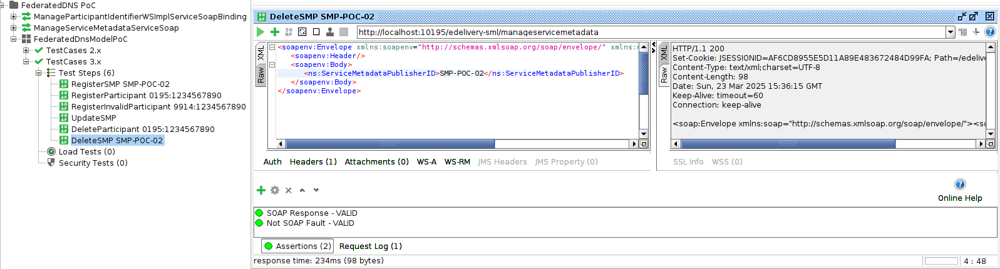

**Result**:

- The response includes an HTTP 200 status code accompanied by a valid SOAP message
- The http://localhost:10195/edelivery-sml/listDNS does not contain participant naptr records:
  `SMP-POC-02.publisher.0088.iso6523.participants.ecosystem.org.	60	IN	CNAME	smp-service-02-updated.local.`


### Test: Use case 4: Registration of the Publishers and participants in subdomain "9914 authoritative" DNS server

NOTE: Please execute Test 1.a and 1.b before executing the test 4.a to ensure that the SML service is correctly registered in the top-level domain DNS server.

The following tests from 4.b are executed using the SoapUI project *FederatedDNS PoC* and the test case "TestCases 4.x".


#### Test: Use case 4.a.: Locate the SML service for the domain "9914" using the DNS lookup.

Execute the following command to resolve the CNAME and NAPTR records for the 9914 domain:

    # Commands to resolve CNAME recors on  ecosystem top domain
    dig @localhost -p 54  9914.sml.ecosystem.org
    # Commands to resolve NAPTR recors on  ecosystem top domain
    dig @localhost -p 54  9914.sml-api.ecosystem.org NAPTR

Responses (following the request order above):

    ;; ANSWER SECTION:
    9914.sml.ecosystem.org.	60	IN	CNAME	vat-num-at-sml.

    ;; ANSWER SECTION:
    9914.sml-api.ecosystem.org. 60	IN	NAPTR	100 10 "U" "Meta:SML" "!.*!http://vat-num-at-sml/edelivery-sml/!" .


#### Test: Use case 4.b.:  Register the SMP data to the subdomain 9914 DNS server.

Open the soapui project *FederatedDNS PoC* locate the test case "TestCases 4.x".
Open and run first step "RegisterSMP: SMP-POC-03".

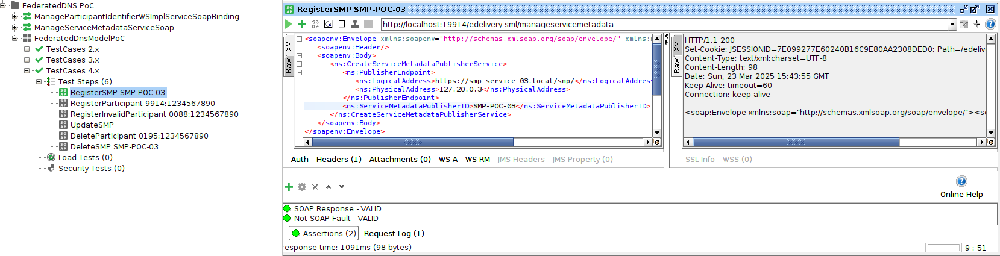

The step registers SMP with identifier SMP-POC-03 to SML-9914 service api, which is exposed to docker host
on port 19914: http://localhost:19914/edelivery-sml/

**Result**:

- The response includes an HTTP 200 status code accompanied by a valid SOAP message
- The http://localhost:19914/edelivery-sml/listDNS contains SMP record:
  `SMP-POC-03.publisher.9914.iso6523.g2b.at.	60	IN	CNAME	smp-service-03.local.`

#### Test: Use case 4.c.: Register the participant data to the subdomain 9914 DNS server.

In the soapui project *FederatedDNS PoC* locate the test case "TestCases 4.x".
Open and run step "RegisterParticipant 9914:1234567890".

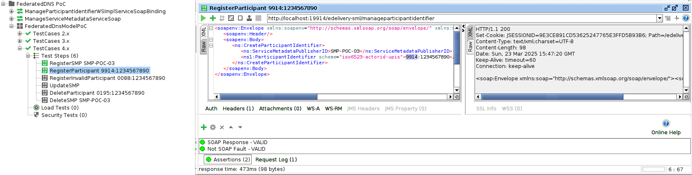

**Result**:

- The response includes an HTTP 200 status code accompanied by a valid SOAP message
- The http://localhost:19914/edelivery-sml/listDNS contains participant record:
  `EOKZTDZ77RSWSZONJ57IMULTBDDVA75AAK3QVMOWAVMGUYWBHXKQ.iso6523-actorid-upis.9914.iso6523.g2b.at.	60	IN	NAPTR	100 10 "U" "Meta:SMP" "!.*!https://smp-service-03.local/smp/!" .`


#### Test: Use case 4.d.: Registering invalid participant (e.g. 0088, 0195)  data to the subdomain 9914 DNS server must fail.

In the soapui project *FederatedDNS PoC* locate the test case "TestCases 4.x".
Open and run step "RegisterInvalidParticipant 0088:1234567890".

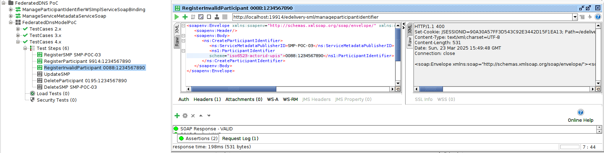

**Result**:

- The response includes an HTTP 400(500) status code accompanied by a SOAP Fault message
- The http://localhost:19914/edelivery-sml/listDNS does not contain any new record:


#### Test: Use case 4.e.: Update the SMP URL to new value

In the soapui project *FederatedDNS PoC* locate the test case "TestCases 4.x".
Open and run step "UpdateSMP". The step updates the SMP URL to the new value: https://smp-service-03-updated.local/smp/.

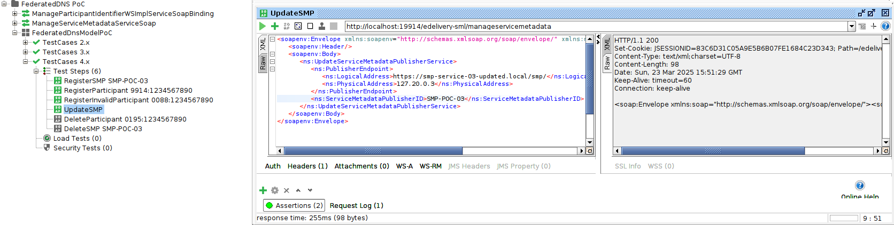

**Result**:

- The response includes an HTTP 200 status code accompanied by a valid SOAP message
- The http://localhost:19914/edelivery-sml/listDNS contains updated SMP and participant naptr records:
  `EOKZTDZ77RSWSZONJ57IMULTBDDVA75AAK3QVMOWAVMGUYWBHXKQ.iso6523-actorid-upis.9914.iso6523.g2b.at.	60	IN	NAPTR	100 10 "U" "Meta:SMP" "!.*!https://smp-service-03-updated.local/smp/!" . 
  SMP-POC-03.publisher.9914.iso6523.g2b.at.	60	IN	CNAME	smp-service-03-updated.local.`

#### Test: Use case 4.f.: Delete the participant data from the subdomain 9914 DNS server.

In the soapui project *FederatedDNS PoC* locate the test case "TestCases 4.x".
Open and run step "DeleteParticipant 9914:1234567890". The step removes the participant record from the SML-9914 service.

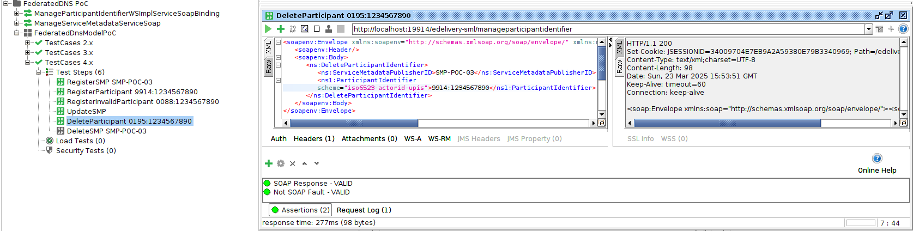

**Result**:

- The response includes an HTTP 200 status code accompanied by a valid SOAP message
- The http://localhost:19914/edelivery-sml/listDNS does not contain participant naptr records:
  `EOKZTDZ77RSWSZONJ57IMULTBDDVA75AAK3QVMOWAVMGUYWBHXKQ.iso6523-actorid-upis.9914.iso6523.g2b.at.	60	IN	NAPTR	100 10 "U" "Meta:SMP" "!.*!https://smp-service-03-updated.local/smp/!"`

#### Test: Use case 4.g.: Remove the SMP record from the subdomain 9914 DNS server.

In the soapui project *FederatedDNS PoC* locate the test case "TestCases 4.x".
Open and run step "DeleteSMP SMP-POC-03". The step removes the participant record from the SML-9914 service.

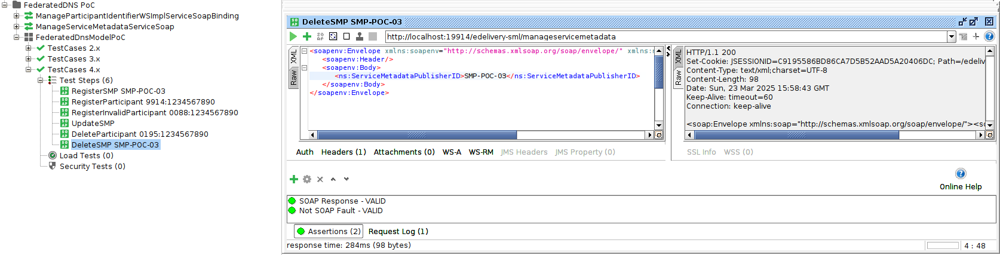

**Result**:

- The response includes an HTTP 200 status code accompanied by a valid SOAP message
- The http://localhost:19914/edelivery-sml/listDNS does not contain participant naptr records:
  `SMP-POC-03.publisher.9914.iso6523.g2b.at.	60	IN	CNAME	smp-service-03-updated.local.`


## Test variant with type **DNS lookup query type 2**

All the tests above are executed with the dns (lookup) query as defined in chapter: **DNS lookup query type 1** in the [Dynamic discovery infrastructure with "federated DNS service"](../README.md) documentation.

Example:

    SQOK3QIXO5V26IRVUCVR2GJVZNVR5AFNB57ABHELYAI72ZIQ7ITQ.iso6523-actorid-upis.0195.iso6523.participants.ecosystem.org

The test variant with query type 2 as example:

    AEY47QMI5YC46ORUMD54WGE6NYT42B57TXXSF3H63OP7FL7ANR3A.0195.iso6523-actorid-upis.participants.ecosystem.org

The experimental SML service docker image domisml:5.0-SNAPSHOT must be used. The domisml image has an TemplateFormatter which can be configured to use custom format of the DNS entries.


### Running the PoC with query type 2

For the Proof of Concept (PoC), the new experimental feature of the custom DNS template formatter has been implemented in DomiSML 5.0.RC1 This feature enables configuration of the DNS hash suffix in a custom format using the parameters DNS_SUFFIX_TMPL and DNS_SUFFIX_SPLIT_REGEXP.

```yaml
IDENTIFIER_DNS_TEMPLATE: >
  MATCH_SCHEME_REGEXP:^(?i)(iso6523-actorid-upis);
  ID_TMPL:$${scheme}\:\:$${identifier};
  ID_SPLIT_REGEXP:^(?i)\\s*(\:\:)?(?<scheme>(iso6523-actorid-upis))\:\:?(?<identifier>.+)?\\s*$;
  DNS_SUFFIX_TMPL:$${icd}.$${scheme};
  DNS_SUFFIX_SPLIT_REGEXP:^(?i)\\s*(\:\:)?(?<scheme>(iso6523-actorid-upis))\:\:?(?<icd>[0-9]{4})?\:(?<identifier>.+)?\\s*$;
  DNS_HASH_MODE:IDENTIFIER_IN_HASH
```

The `DNS_SUFFIX_SPLIT_REGEXP` parameter is responsible for parsing identifiers and extracting template values from them. The `DNS_SUFFIX_TMPL` parameter defines DNS identifier suffix which follows the hashed value. The suffix is based on the previously parsed values, such as `icd` and `scheme`. The `DNS_HASH_MODE` is set to `IDENTIFIER_IN_HASH`, meaning only the identifier is used in the hash value for the DNS entry.

The DNS template formatter is configured within the Docker Compose file `duc04-registration/docker-compose-dns-query-type-2.yml`!

To run the PoC with the ith query type 2, execute the following command from the root folder of the repository:

```shell
# Start the PoC environment 
 docker compose -f uc04-registration/docker-compose-dns-query-type-2.yml up -d

# to clean startup of the PoC environment 
docker compose -f uc04-registration/docker-compose-dns-query-type-2.yml down -v && docker compose -f uc04-registration/docker-compose-dns-query-type-2.yml up -d
```

Please note that the environment is using  `uc04-registration/docker-compose-dns-query-type-2.yml` compose file  with different DNS domains and DNS zones which matches `iso6523-actorid-upis.participants.ecosystem.org` format.

The process for running the tests is identical to the previous section, except for the following cases where the "participant identifier regular expression validation" is not yet supported for the experimental DNS template formatter feature:

- **TestCases 2.x**: RegisterInvalidParticipant 9914:1234567890
- **TestCases 3.x**: RegisterInvalidParticipant 9914:1234567890
- **TestCases 4.x**: RegisterInvalidParticipant 0088:1234567890
