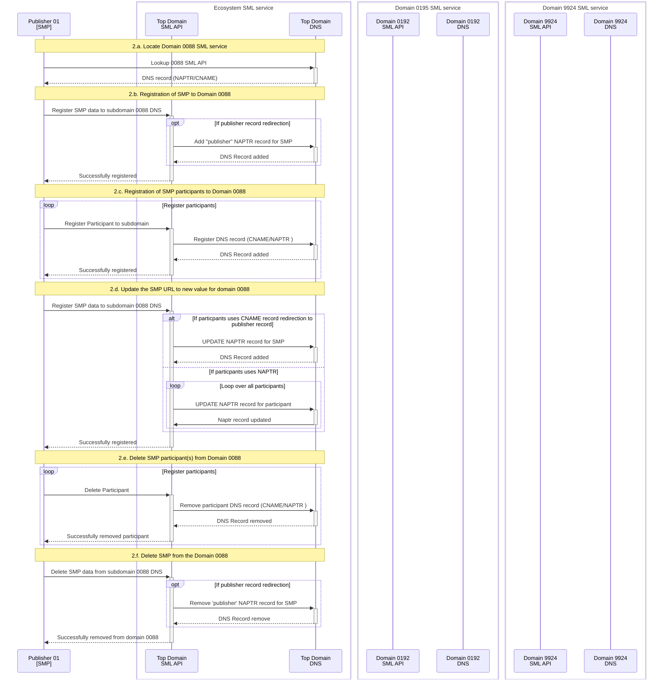
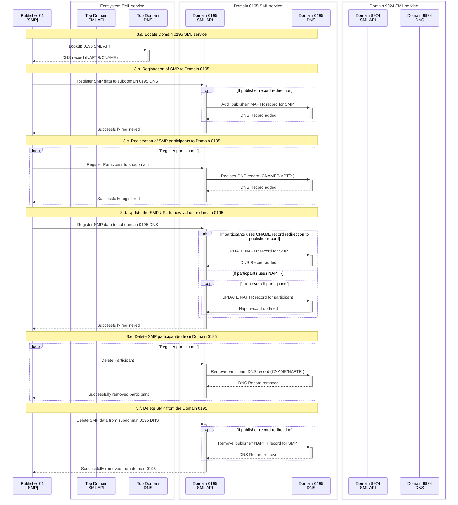
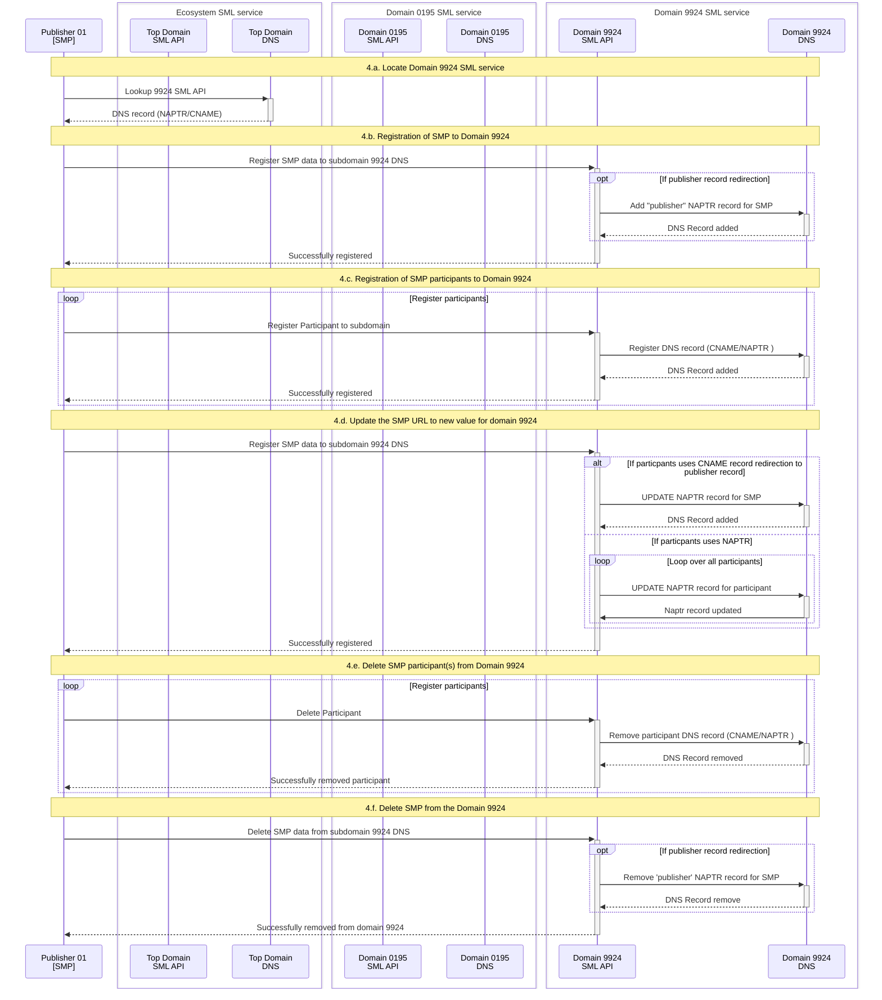

# Registration of the Publishers and participants in federated environment

## Introduction

The UC Registration module is designed to test the registration of publisher providers
(SMPs) and participants within a federated SML service environment. The tests are 
designed to assume that all necessary SMP DNS records (e.g. publisher records) for 
the subzone are stored on the subdomain's authoritative DNS server (e.g., 9914, 0195).
This model is also known in the Peppol Federated model PoC as the 2.B.1 registration model.

The big advantage of this model is best back-compatibility fit on the registration
process and existing SML services. The only difference is that SMPs must register 
to each SML authoritative subzone service where they will offer the registration 
of the participant records. Another big advantage is that the SML service provider
is the only one responsible to keep SML clean without "dangling" records across
multiple DNS servers.


The primary advantage of this model is its superior backward compatibility with the 
registration process using existing SML service API. The only change required is that 
SMPs must register with each SML authoritative subzone service where they intend to
offer for participant. Another significant benefit is that the SML service provider 
is solely responsible for maintaining a clean SML DNS records, without "dangling"
records spread across multiple DNS servers.

##  Testing environment setup

The existing Testing environment is extended with the following components:

 - **Ecosystem SML service** - The top-level domain SML service, responsible for
   managing the DNS records for the subdomain 0088 .
 - **Domain 0195 SML service** - The subdomain 0195 SML service, responsible for managing
   the DNS records for the subdomain 0195.
 - **Domain 9924 SML service** - The subdomain 9924 SML service, responsible for managing
   the DNS records for the subdomain 9924.


## Use cases

The PoC environment is designed to showcase various methods of subdomain delegation
within DNS infrastructure, as well as different strategies for organizing internal
DNS server records (e.g using CNAME for easier maintenance of final DNS record data).
The following tests cases are using exiting SML service implementation which supports 
the SML service API as defined in the 

### Use case 1: Registration of SML service providers in the top-level domain "sml.ecosystem.org" DNS server

The use case is designed to test the registration of the SML service providers in
the top-level domain SML service. The test involves the registration of CNAME and 
NAPTR records for the SML service providers in the top-level domain DNS server. 

The records provide an easy lookup for the SMP service providers to automatically 
locate the SML service API where particular subdomain (e.g. 0088, 0195, 9914) records 
are managed.

In the tests two types of records are explored:

- **CNAME Records** serve as aliases for the DNS entries of the SML service provider. 
These records enable the SMP provider to simply use the ecosystem SML URL template 
(e.g., https://[subdomain].sml.ecosystem.org/sml) to use  the actual SML service API URL.
The URL scheme, port, and context path are predefined according to the ecosystem's regulations. 
Consequently, the SML service provider must publish services in compliance with these rules,
including ensuring the server certificate matches requirements when using the HTTPS URL scheme.
 
- **NAPTR Records** are used to retrieve the custom URL of the SML service provider's. 
In this case the SML service provider defines their own URL scheme, port, and context path 
and register then to the top-level domain DNS server. The NAPTR records gives more freedom 
to SML service providers on how they want to publish their services, but on the ather hand, 
the SMP provider has one more step to resolve the actual SML service API URL.


## 1.a. Registration of the CNAME record for the SML service providers

The usecase contains registration of CNAME records for the SML service providers (0088, 0195, 9924) in the top-level domain DNS server and verification of the lookup of th e SML service.

1. Registration of the CNAME records for the SML service providers
2. Validation of the SML service API endpoint

## 2.a. Registration of the NAPTR record for the SML service providers

The usecase contains registration of NAPTR records for the SML service providers (0088, 0195, 9924) in the top-level domain DNS server and verification of the lookup of th e SML service.

1. Registration of the NAPTR records for the SML service providers
2. Lookup of the SML service API NAPTR record
3. Validation of the SML service API endpoint


### Use case 2: Registration of the Publishers and participants in the top-level domain "0088 authoritative" DNS server

The usecase is designed to test the registration of the SMPs and participants in the  domain "0088" which is managed by the top-level domain SML service. The test case involves the following steps: 

- **2.a.**: Locate the SML service for the domain "0088" using the DNS lookup.
- **2.b.**: Register the SMP data to the subdomain 0088 DNS server.
- **2.c.**: Register the participant data to the subdomain 0088 DNS server.
- **2.d.**: Update the SMP URL to new value
- **2.e.**: Delete the participant data from the subdomain 0088 DNS server.
- **2.f.**: Delete the SMP data from the subdomain 0088 DNS server.




### Use case 3: Registration of the Publishers and participants in the Delegated (NS): "0195 authoritative" DNS server

The usecase is designed to test the registration of the SMPs and participants in the domain "0195" which is managed by the dedicated authoritative 0195 domain SML service. The SML service is using the "NS binding" to redirect the DNS queries to the top-level domain SML service.

The test case involves the following steps:

- **3.a.**: Locate the SML service for the domain "0195" using the DNS lookup.
- **3.b.**: Register the SMP data to the subdomain 0195 DNS server.
- **3.c.**: Register the participant data to the subdomain 0195 DNS server.
- **3.d.**: Update the SMP URL to new value
- **3.e.**: Delete the participant data from the subdomain 0195 DNS server.
- **3.f.**: Delete the SMP data from the subdomain 0195 DNS server.





### Use case 4: Registration of the Publishers and participants in the Redirected (DNAME): "9914 authoritative" DNS server

The usecase is designed to test the registration of the SMPs and participants in the domain "9914" which is managed by the dedicated authoritative 9914 domain SML service. The SML service is using the "DNAME binding" to redirect the DNS queries to the top-level domain SML service.

The test case involves the following steps:


- **4.a.**: Locate the SML service for the domain "0195" using the DNS lookup.
- **4.b.**: Register the SMP data to the subdomain 0195 DNS server.
- **4.c.**: Register the participant data to the subdomain 0195 DNS server.
- **4.d.**: Update the SMP URL to new value
- **4.e.**: Delete the participant data from the subdomain 0195 DNS server.
- **4.f.**: Delete the SMP data from the subdomain 0195 DNS server.





## Environment Setup

To execute the tests for the use cases, the DNS infrastructure as described in the [README.md](../README.md) was
extended with the following [docker services](docker-compose.yml)

- **ecosystem-top-domain-sml** - The top-level domain SML service, responsible for
  managing the DNS records for the subdomain 0088 .
- **invoice-sg-sml** - The subdomain 0195 SML service, responsible for managing
  the DNS records for the subdomain 0195.
- **vat-num-at-sml** - The subdomain 9924 SML service, responsible for managing
  the DNS records for the subdomain 9924.

All new docker services are using the same docker image [domisml:4.3.1](../docker-domisml/README.md).
Because the docker image is not accessible from any public docker repository (e. g. docker hub), the image must be built locally before executing the tests. The image is built using the following command:

```shell
  docker compose -f docker-domisml/docker-compose.yml build
```
For detailed information on how to build the docker image, please refer to the [README.md](../docker-domisml/README.md) file.


## Running the PoC


    # Start the PoC environment (ommite the folder uc04-registration if you are already in uc04-registration folder )
    docker compose -f uc04-registration/docker-compose.yml  up -d

    # Stop the PoC environment
    docker compose -f uc04-registration/docker-compose.yml down -v

    # 'clean restart' the PoC environment
    docker compose -fuc04-registration/docker-compose.yml down -v && docker compose -f uc04-registration/docker-compose.yml up -d

Before starting the PoC environment, make sure that log files in the `logs` directory have read and write permissions for all users. If not, run the following command:

    chmod a+rw logs/*
    # or
    chmod a+rw uc04-transition/logs/*

Please note that all new SML containers expose ports to access sml service API. The ports are:

- ecosystem-top-domain-sml: 10088
- invoice-sg-sml: 10195
- vat-num-at-sml: 19914


After starting the PoC environment, check all running containers:

    docker ps --format '{{.Names}}' | sort
    #Response:
    client-with-rdns
    ecosystem-top-domain
    ecosystem-top-domain-sml
    invoice-sg
    invoice-sg-sml
    vat-num-at
    vat-num-at-sml

Please note that each DNS server has now dedicated SML service which provides management API for the DNS.


Simple smoke tests to resolve A records. The purpose of the test is to verify that the DNS server is running and resolving the DNS queries. Result for all queries should be the IP address 127.0.0.1

    # Test all SML services are up and runnging (using wget from client-with-rdns container)
    docker exec -it client-with-rdns wget --spider http://ecosystem-top-domain-sml:8080/edelivery-sml
    docker exec -it client-with-rdns wget --spider http://invoice-sg-sml:8080/edelivery-sml
    docker exec -it client-with-rdns wget --spider http://vat-num-at-sml:8080/edelivery-sml
    # all responses shuld return:
    #    Connecting to ecosystem-top-domain-sml:8080 (172.20.0.202:8080) 
    #    remote file exists

Another option is just to add the following URL address to docker hosts browser
(please note the port number for each SML service):

    http://localhost:10088/edelivery-sml/
    http://localhost:10195/edelivery-sml/
    http://localhost:19914/edelivery-sml/

    #to see all SML registerd DNS records on the SML service
    http://localhost:10088/edelivery-sml/listDN
    http://localhost:10195/edelivery-sml/listDN
    http://localhost:19914/edelivery-sml/listDN


### Test: Use case 1.a: Registration of the CNAME record for the SML service providers 

The test is to verifies the registration of the CNAME records for the SML service providers (0088, 0195, 9924) in the top-level domain DNS server and validation of the lookup of the SML service. to register cname records the `nsupdate` command is used. The command is executed in the `client-with-rdns` container. The command is executed with the following command:


    docker exec -it ecosystem-top-domain sh -c 'echo -e "server localhost\nzone ecosystem.org.\n update \
            add 0088.sml.ecosystem.org. 60  CNAME ecosystem-top-domain-sml.\n \
            add 0195.sml.ecosystem.org. 60  CNAME invoice-sg-sml.\n \
            add 9914.sml.ecosystem.org. 60  CNAME vat-num-at-sml.\n  \
            send" | nsupdate -4'

Explanation of the command:

To add records to the DNS server, the `nsupdate` command is used. To execute the in the `ecosystem-top-domain` container the docker command `docker exec -it ecosystem-top-domain` is used.

The following `nsupdate` command consists of the following parts:

- `sh -c echo -e `: Prints the update request to the standard shell output which is the input for the nsupdate.
- The update request consists of the following parts:
    - `server localhost`: Specifies the DNS server to which the update request is sent.
    - `zone ecosystem.org.`: Specifies the zone to be updated.
    - `update`:
        - `add  9954.iso6523.participants.ecosystem.org. 60  DNAME iso6523-actorid-upis.edelivery.tech.ec.europa.eu.`: Adds a DNAME record for the domain 9954.iso6523.participants.ecosystem.org. The DNAME record redirects the domain to the incubator DNS server.
        - `add  0151.iso6523.participants.ecosystem.org. 60  DNAME iso6523-actorid-upis.edelivery.tech.ec.europa.eu.`: Adds a DNAME record for the domain 0151.iso6523.participants.ecosystem.org. The DNAME record redirects the domain to the incubator DNS server.
    - `send`: Sends the update request to the DNS server.

After the configuration, the DNS records should be resolved by the ecosystem DNS server.

    # Command 1: resolve with ecosystem top domain
    dig @localhost -p 54 NAPTR IDUC1ABCD.9954.iso6523.participants.ecosystem.org
    dig @localhost -p 54 NAPTR IDUC3ABCF.0151.iso6523.participants.ecosystem.org

Responses:

    ;; ANSWER SECTION:
    9954.iso6523.participants.ecosystem.org. 60 IN DNAME iso6523-actorid-upis.edelivery.tech.ec.europa.eu.
    IDUC1ABCD.9954.iso6523.participants.ecosystem.org. 60 IN CNAME IDUC1ABCD.iso6523-actorid-upis.edelivery.tech.ec.europa.eu.
    IDUC1ABCD.iso6523-actorid-upis.edelivery.tech.ec.europa.eu. 60 IN NAPTR 100 10 "U" "Meta:SMP" "!.*!http://127.0.0.1:8080/smp-inc-uc-01/!" .

    ;; ANSWER SECTION:
    0151.iso6523.participants.ecosystem.org. 60 IN DNAME iso6523-actorid-upis.edelivery.tech.ec.europa.eu.
    IDUC3ABCF.0151.iso6523.participants.ecosystem.org. 60 IN CNAME IDUC3ABCF.iso6523-actorid-upis.edelivery.tech.ec.europa.eu.
    IDUC3ABCF.iso6523-actorid-upis.edelivery.tech.ec.europa.eu. 60 IN NAPTR 100 10 "U" "Meta:SMP" "!.*!http://127.0.0.1:8080/smp-inc-uc-03/!" .


```shell
# registration of the CNAME records for the SML service providers

docker exec -it client-with-rdns sh /nsupdate/uc04-registration/1a-register-cname.sh
```


